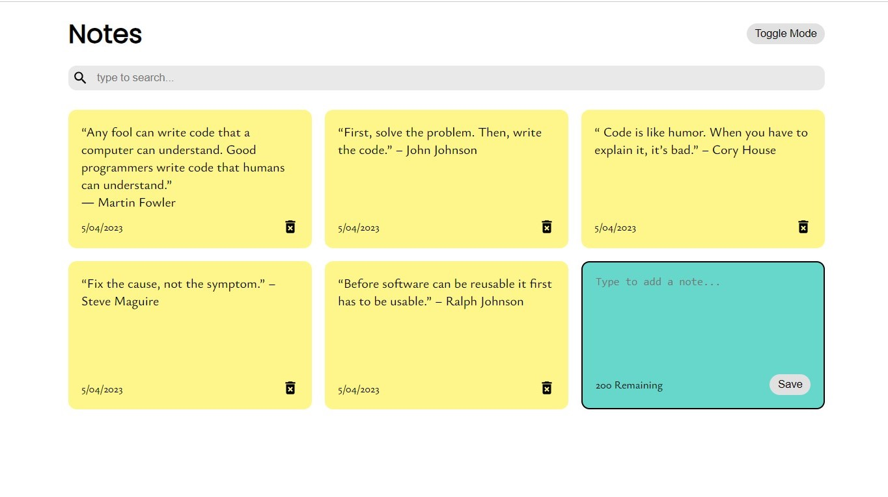
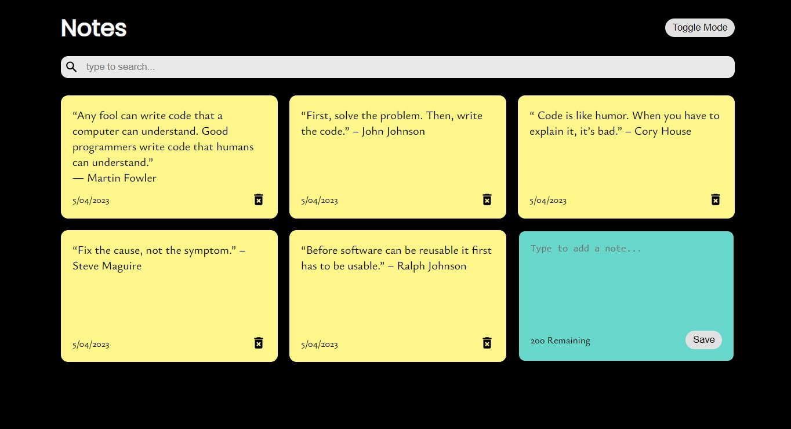

# Notes App

This is a simple notes app built using ReactJS. The application allows users to create, search, and delete notes, providing an intuitive interface for managing personal or work-related information efficiently. The app leverages ReactJS to offer a dynamic and responsive user experience. It also stores the notes in the local storage of the browser.

-----------
## Screenshots
1. Light Mode



2. Dark Mode



----
## Features

- **Create :** Users can easily create new notes by providing the content.

- **Delete Notes:** Users have the option to delete unwanted or outdated notes from the app.

- **Search Notes:** The app provides a search functionality, allowing users to find specific notes based on the content. This feature helps users quickly locate relevant information within their collection of notes.

----
## Getting Started

To get started with the Notes App locally, follow these instructions:

1. Clone the repository: `git clone https://github.com/rahulmaurya-exe/notes-app.git`
2. Navigate to the project directory: `cd notes-app`
3. Install the dependencies: `npm install`
4. Start the development server: `npm start`
5. Open your web browser and visit: `http://localhost:3000`

----
## Dependencies

The following dependencies are used in this project:

- **React:** A JavaScript library for building user interfaces.
- **React Icons:** A library that provides a set of customizable icons for React components.
- **uuid:** A library used for generating unique IDs for notes.

These dependencies are automatically installed when running the `npm install` command.

---
## Folder Structure

The project structure is organized as follows:

```
notes-app/
  ├── src/
  │   ├── components/
  │   │   ├── NotesList.js
  │   │   ├── AddNote.js
  │   │   └── ...
  │   ├── App.js
  │   ├── index.js
  │   └── ...
  ├── public/
  ├── package.json
  ├── README.md
  └── ...
```

- **src/components:** Contains reusable components used in the app, such as `NotesList` and `AddNote`.
- **src/App.js:** The main component that renders the app and manages the state of notes.
- **src/index.js:** The entry point of the application.
- **public:** Contains the public assets of the app, including the HTML file and the favicon.

Feel free to explore the codebase and modify it according to your requirements.

---
## License

This project is licensed under the [MIT License](https://opensource.org/licenses/MIT). Feel free to use, modify, and distribute the code as per the terms of this license.

---